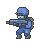

# Killer Elite

Shooter game using Phaser 3.

## Built With

- Javascript
- Bootstrap
- NPM Webpack
- Phaser 3

## Live Demo

[Live Demo Link](https://infallible-shannon-bbd3f2.netlify.app/)

## Game Design Document

### Characters

| **Player** | **enemies** |
|--------|---------|
|  |  |

### Controls

- Player can move right, left and jump using the arrow keys.
- hold space key for automatic fire or tap for semi-automatic fire (faster fire-rate).

### Objective

- Kill enemies to earn points while dodging enemy bullets and navigating through the terrain spaced to make every jump hard.

### Optional

- After the game if you are satisfied with your score you can save it to try to get into the Top Ten

## Requirements

[Node.js](https://nodejs.org) is required to install dependencies and run scripts via `npm`.

## Available Commands

| Command | Description |
|---------|-------------|
| `npm install` | Install project dependencies |
| `npm start` | Build project and open web server running project |
| `npm run build` | Builds code bundle with production settings (minification, uglification, etc..) |

## Getting Started

- First clone the project by running `git clone https://github.com/sjcco/shooter-game.
- navigate to project folder using `cd`.
- Run `npm install` to install the needed.
- Run `npm start` to open in browser.

## Authors

👤 **Juan Carlos Campos Ojeda**

- GitHub: [@sjcco](https://github.com/githubhandle)
- Twitter: [@CarlosCamposO](https://twitter.com/twitterhandle)
- LinkedIn: [jcarlos-campos](https://linkedin.com/jcarlos-campos)

## 🤝 Contributing

Contributions, issues, and feature requests are welcome!

Feel free to check the [issues page](http://github.com/sjcco/shooter-game/issues/).

## Show your support

Give a ⭐️ if you like this project!

## Acknowledgments

- microverse team

## 📝 License

Available as open source under the terms of the [MIT](https://opensource.org/licenses/MIT) licence.